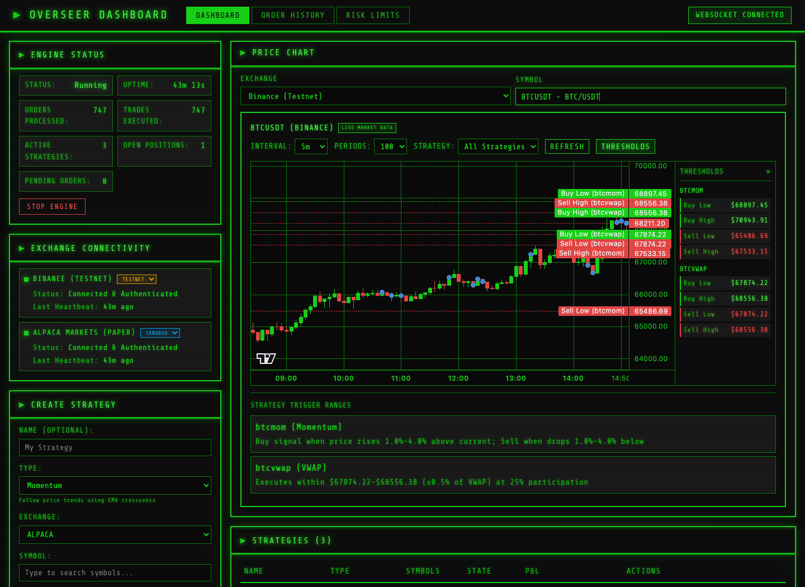
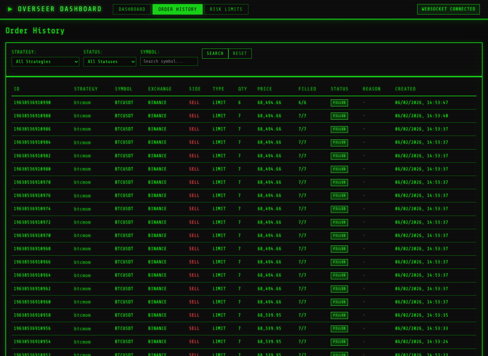

# Overseer - High-Frequency Trading Client

> **Educational Project** — This project was built for learning purposes to understand the industry patterns and technologies used in high-throughput trading systems. It explores low-latency architecture, exchange connectivity, trading strategy design, and real-time risk management. **It is not intended for production trading.**

### Dashboard — Momentum and VWAP strategies running against Binance testnet BTCUSDT


### Order History — Full order log with filtering by strategy, exchange, and symbol


## What Is This?

Overseer is a modular trading client written in Java with a React dashboard. It connects to real exchange APIs (Alpaca for stocks, Binance for crypto) and provides a hands-on environment to learn about:

- How trading systems are architected for speed and reliability
- How orders flow from strategy signal to exchange execution
- How positions, P&L, and risk are tracked in real time
- How persistence works without garbage collection overhead
- How algorithmic trading strategies generate buy/sell decisions

The system supports **paper trading** (Alpaca) and **testnet** (Binance) modes, so you can experiment safely without risking real money.

---

## Key Features

### Live Dashboard

A real-time web dashboard that updates via WebSocket, giving you visibility into everything the system is doing.

- **Engine controls** — Start and stop the trading engine
- **Exchange connectivity** — Connect to Alpaca (stocks) or Binance (crypto), switch between sandbox and live modes
- **Strategy management** — Create, start, stop, and inspect trading strategies
- **Interactive charts** — Candlestick price charts with strategy threshold overlays, powered by Lightweight Charts
- **Position monitoring** — See current holdings, average entry prices, and unrealized P&L
- **Order tracking** — Watch orders flow through their lifecycle in real time
- **Risk limits** — View and configure risk parameters

### Trading Strategies

Four built-in strategies demonstrate different approaches to algorithmic trading:

| Strategy | Approach | What It Teaches |
|----------|----------|-----------------|
| **Momentum** | Follows price trends using moving average crossovers (short MA vs long MA). Buys when short-term momentum exceeds a threshold, sells when it reverses. | Trend-following, signal generation, EMA calculations |
| **Mean Reversion** | Trades the assumption that prices return to their historical average. Buys when price drops below 2 standard deviations, sells when it rises above. | Statistical trading, Z-scores, Bollinger Band concepts |
| **VWAP** | Executes a large order by distributing it across the day proportionally to historical volume patterns, minimizing market impact. | Execution algorithms, volume profiling, participation rates |
| **TWAP** | Splits a large order into equal time slices and executes them at regular intervals over a set duration. | Time-sliced execution, catch-up logic, order scheduling |

### Risk Management

A pluggable risk engine evaluates every order before it reaches the exchange:

- **Max order size** and **max order notional** — Prevents oversized individual orders
- **Max position size** — Limits exposure to any single instrument
- **Max net/gross exposure** — Controls overall portfolio risk
- **Daily order and notional limits** — Caps daily trading activity
- **Daily loss limit** — Stops trading when losses exceed a threshold
- **Circuit breaker** — Automatically halts trading after repeated risk violations, with cooldown recovery

### Exchange Connectivity

Connect to real exchanges with automatic credential verification:

- **Alpaca** — US stocks via REST and WebSocket APIs. Supports paper trading (sandbox) for risk-free experimentation.
- **Binance** — Cryptocurrency pairs via REST and WebSocket APIs. Supports testnet for safe testing.
- **Stub mode** — A fully simulated in-process exchange for offline development and testing.

Mode switching is done at runtime from the dashboard. Credentials are verified with actual API calls before reporting a connected status.

### Persistence

All system state survives application restarts using Chronicle Queue, an off-heap, memory-mapped persistence library designed for low-latency systems:

- **Orders** — Full order lifecycle preserved and replayed on startup
- **Trades** — Complete trade history with fill details
- **Positions** — Latest position snapshots restored automatically, so you pick up where you left off
- **Strategies** — Strategy definitions and parameters restored, algorithm instances recreated
- **Audit log** — Every engine event, risk check, and state change recorded for review

---

## Architecture Highlights

This project demonstrates several patterns commonly found in professional trading systems:

| Pattern | Implementation | Why It Matters |
|---------|---------------|----------------|
| **Hexagonal Architecture** | Domain core has zero external dependencies; exchanges are pluggable adapters | Keeps business logic isolated and testable |
| **Event-Driven Processing** | LMAX Disruptor ring buffer (64K events) with pipelined handlers | Lock-free, single-writer pattern for predictable latency |
| **Object Pooling** | Reusable Order objects via `ObjectPool<T>` | Reduces GC pressure in hot paths |
| **Zero-GC Persistence** | Chronicle Queue with memory-mapped files and Wire serialization | Writes to disk without allocating heap objects |
| **Integer Arithmetic** | All prices stored as `long` with configurable scale (100 for stocks, 100M for crypto) | Eliminates floating-point errors in financial calculations |
| **Primitive Collections** | Agrona collections instead of JDK wrappers | Avoids boxing overhead for high-throughput data |

For detailed architecture diagrams and algorithm visualizations, see [docs/ARCHITECTURE.md](docs/ARCHITECTURE.md).

---

## Getting Started

### Prerequisites

- **Java 21** — `brew install openjdk@21`
- **Node.js 18+** — For the React frontend

### Build and Run

```bash
# Build everything (backend + frontend)
./gradlew build

# Start the application
./scripts/run-app.sh --full

# Open the dashboard
open http://localhost:8080
```

### Run Tests

```bash
# Backend tests
./gradlew test

# Frontend tests
cd hft-ui && npm test
```

### Development Mode

For frontend development with hot reload:

```bash
# Terminal 1: Start the backend
./scripts/run-app.sh

# Terminal 2: Start the frontend dev server
cd hft-ui && npm run dev
# Opens at http://localhost:3000 with proxy to backend
```

---

## Project Structure

```
hft-client/
├── hft-core/              Domain models and port interfaces (zero dependencies)
├── hft-algo/              Trading algorithms (VWAP, TWAP, Momentum, Mean Reversion)
├── hft-engine/            LMAX Disruptor event processing, order and position management
├── hft-risk/              Risk engine, circuit breaker, configurable risk rules
├── hft-exchange-api/      Exchange adapter interfaces
├── hft-exchange-alpaca/   Alpaca REST/WebSocket adapter (stocks)
├── hft-exchange-binance/  Binance REST/WebSocket adapter (crypto)
├── hft-persistence/       Chronicle Queue stores (orders, trades, positions, strategies, audit)
├── hft-api/               Spring Boot REST/WebSocket API, exchange and strategy management
├── hft-app/               Application assembly and configuration
├── hft-ui/                React + TypeScript dashboard (Vite, Lightweight Charts)
├── hft-bdd/               Cucumber BDD tests and JMH performance benchmarks
└── docs/                  Architecture documentation with Mermaid diagrams
```

---

## Disclaimer

This is an **educational project**. It is not financial advice, and it is not designed or tested for live trading with real money. The strategies included are simplified implementations meant to illustrate concepts, not to generate profit. Use at your own risk.
