# HFT Client Architecture Documentation

This document provides visual documentation of the HFT trading system architecture, including component interactions, sequence diagrams for main operations, and explanations of trading algorithms.

## Table of Contents

1. [System Architecture Overview](#system-architecture-overview)
2. [Module Structure](#module-structure)
3. [Component Interactions](#component-interactions)
4. [Sequence Diagrams](#sequence-diagrams)
5. [Trading Algorithms](#trading-algorithms)
6. [Risk Management](#risk-management)
7. [Persistence Layer](#persistence-layer)
8. [Testing Strategy](#testing-strategy)

---

## System Architecture Overview

The system follows **Hexagonal Architecture** (Ports & Adapters) with a high-performance event-driven core using LMAX Disruptor.

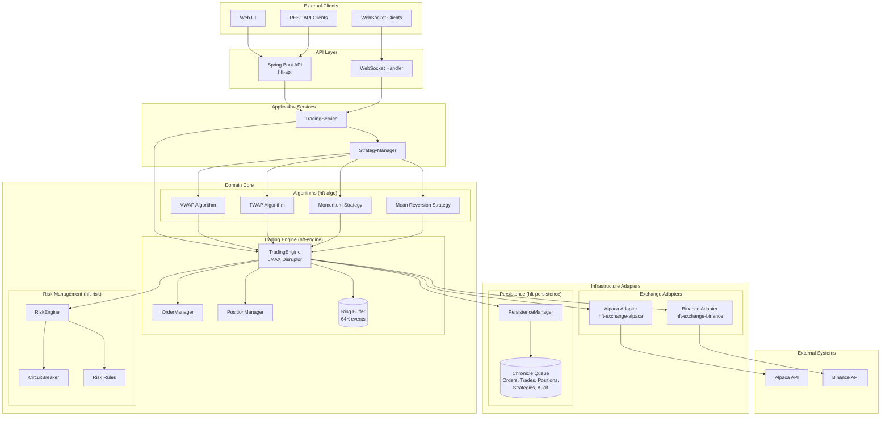
```mermaid
graph TB
    subgraph "External Clients"
        WEB[Web UI]
        REST[REST API Clients]
        WS[WebSocket Clients]
    end

    subgraph "API Layer"
        API[Spring Boot API<br/>hft-api]
        WSH[WebSocket Handler]
    end

    subgraph "Application Services"
        TS[TradingService]
        SM[StrategyManager]
    end

    subgraph "Domain Core"
        subgraph "Trading Engine (hft-engine)"
            TE[TradingEngine<br/>LMAX Disruptor]
            OM[OrderManager]
            PM[PositionManager]
            RB[(Ring Buffer<br/>64K events)]
        end

        subgraph "Algorithms (hft-algo)"
            VWAP[VWAP Algorithm]
            TWAP[TWAP Algorithm]
            MOM[Momentum Strategy]
            MR[Mean Reversion Strategy]
        end

        subgraph "Risk Management (hft-risk)"
            RE[RiskEngine]
            CB[CircuitBreaker]
            RR[Risk Rules]
        end
    end

    subgraph "Infrastructure Adapters"
        subgraph "Exchange Adapters"
            ALP[Alpaca Adapter<br/>hft-exchange-alpaca]
            BIN[Binance Adapter<br/>hft-exchange-binance]
        end

        subgraph "Persistence (hft-persistence)"
            PER[PersistenceManager]
            CQ[(Chronicle Queue<br/>Orders, Trades, Positions,<br/>Strategies, Audit)]
        end
    end

    subgraph "External Systems"
        ALPACA[Alpaca API]
        BINANCE[Binance API]
    end

    WEB --> API
    REST --> API
    WS --> WSH

    API --> TS
    WSH --> TS
    TS --> SM
    TS --> TE

    SM --> VWAP
    SM --> TWAP
    SM --> MOM
    SM --> MR

    TE --> RB
    TE --> OM
    TE --> PM
    TE --> RE

    RE --> CB
    RE --> RR

    TE --> ALP
    TE --> BIN
    TE --> PER

    ALP --> ALPACA
    BIN --> BINANCE
    PER --> CQ

    VWAP --> TE
    TWAP --> TE
    MOM --> TE
    MR --> TE
```

---

## Module Structure

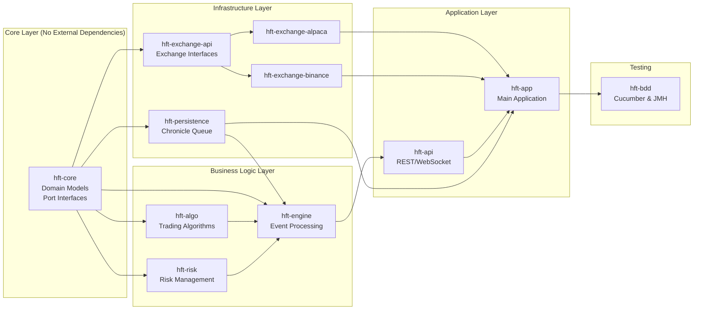
```mermaid
graph LR
    subgraph "Core Layer (No External Dependencies)"
        CORE[hft-core<br/>Domain Models<br/>Port Interfaces]
    end

    subgraph "Business Logic Layer"
        ALGO[hft-algo<br/>Trading Algorithms]
        RISK[hft-risk<br/>Risk Management]
        ENGINE[hft-engine<br/>Event Processing]
    end

    subgraph "Infrastructure Layer"
        EXAPI[hft-exchange-api<br/>Exchange Interfaces]
        ALPACA[hft-exchange-alpaca]
        BINANCE[hft-exchange-binance]
        PERSIST[hft-persistence<br/>Chronicle Queue]
    end

    subgraph "Application Layer"
        API[hft-api<br/>REST/WebSocket]
        APP[hft-app<br/>Main Application]
    end

    subgraph "Testing"
        BDD[hft-bdd<br/>Cucumber & JMH]
    end

    CORE --> ALGO
    CORE --> RISK
    CORE --> ENGINE
    CORE --> EXAPI
    CORE --> PERSIST

    EXAPI --> ALPACA
    EXAPI --> BINANCE

    ALGO --> ENGINE
    RISK --> ENGINE
    PERSIST --> ENGINE

    ENGINE --> API
    ALPACA --> APP
    BINANCE --> APP
    API --> APP
    PERSIST --> APP

    APP --> BDD
```

### Module Responsibilities

| Module | Responsibility |
|--------|---------------|
| `hft-core` | Domain models (Order, Quote, Position, Trade), port interfaces |
| `hft-algo` | Trading algorithms (VWAP, TWAP) and strategies (Momentum, Mean Reversion) |
| `hft-risk` | Risk engine, circuit breaker, configurable risk rules |
| `hft-engine` | LMAX Disruptor event processing, order/position management |
| `hft-exchange-api` | Exchange port interface definitions |
| `hft-exchange-alpaca` | Alpaca REST/WebSocket adapter |
| `hft-exchange-binance` | Binance REST/WebSocket adapter |
| `hft-persistence` | Chronicle Queue persistence (orders, trades, positions, strategies, audit) |
| `hft-api` | Spring Boot REST/WebSocket API, exchange connectivity, strategy management |
| `hft-app` | Application assembly and configuration |
| `hft-ui` | React + TypeScript dashboard (Vite, Lightweight Charts, STOMP WebSocket) |
| `hft-bdd` | Cucumber BDD tests and JMH benchmarks |

---

## Price Scale Handling

The system supports multiple exchanges with different price precision requirements. All prices are stored as `long` integers using a `priceScale` factor to maintain precision without floating-point errors.

### Exchange-Specific Price Scales

| Exchange | Price Scale | Decimal Places | Example |
|----------|-------------|----------------|---------|
| Alpaca (Stocks) | 100 | 2 | $150.00 = 15000L |
| Binance (Crypto) | 100,000,000 | 8 | 0.00001234 BTC = 1234L |

### Price Scale Flow

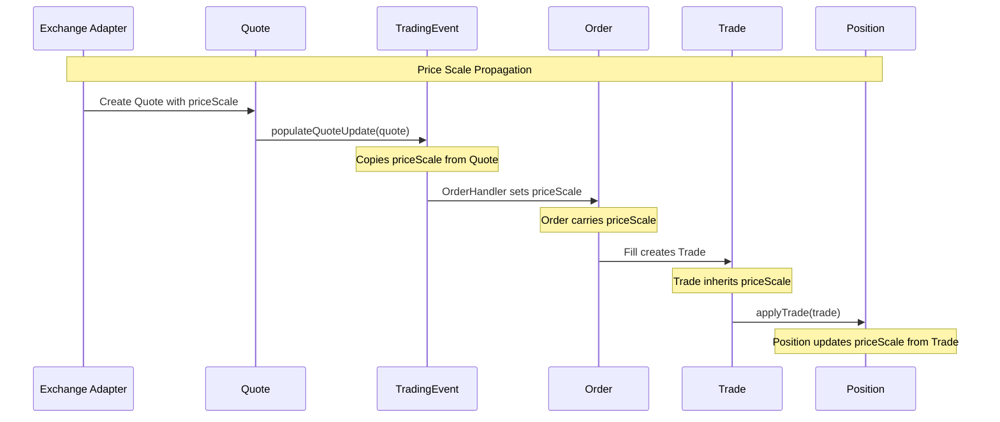
```mermaid
sequenceDiagram
    participant EX as Exchange Adapter
    participant Q as Quote
    participant TE as TradingEvent
    participant O as Order
    participant T as Trade
    participant P as Position

    Note over EX,P: Price Scale Propagation

    EX->>Q: Create Quote with priceScale
    Q->>TE: populateQuoteUpdate(quote)
    Note over TE: Copies priceScale from Quote

    TE->>O: OrderHandler sets priceScale
    Note over O: Order carries priceScale

    O->>T: Fill creates Trade
    Note over T: Trade inherits priceScale

    T->>P: applyTrade(trade)
    Note over P: Position updates priceScale from Trade
```

### P&L Calculation with Different Scales

Positions maintain their native price scale for accurate P&L calculations:

```
UnrealizedPnL = (currentMarketPrice - averageEntryPrice) × quantity
```

Both `currentMarketPrice` and `averageEntryPrice` must use the same scale for correct calculation.

### Risk Limit Normalization

Risk limits are stored in **cents (scale 100)** for consistency. When checking limits, P&L values are normalized:

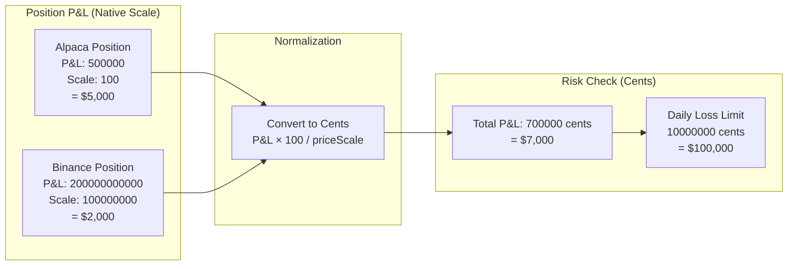
```mermaid
graph LR
    subgraph "Position P&L (Native Scale)"
        AP[Alpaca Position<br/>P&L: 500000<br/>Scale: 100<br/>= $5,000]
        BP[Binance Position<br/>P&L: 200000000000<br/>Scale: 100000000<br/>= $2,000]
    end

    subgraph "Normalization"
        NORM[Convert to Cents<br/>P&L × 100 / priceScale]
    end

    subgraph "Risk Check (Cents)"
        TOTAL[Total P&L: 700000 cents<br/>= $7,000]
        LIMIT[Daily Loss Limit<br/>10000000 cents<br/>= $100,000]
    end

    AP --> NORM
    BP --> NORM
    NORM --> TOTAL
    TOTAL --> LIMIT
```

**Key Methods:**
- `PositionManager.getTotalPnlCents()` - Returns P&L normalized to cents
- `RiskManager.checkPreTradeRisk()` - Compares normalized P&L against limits

---

## Component Interactions

### Event-Driven Architecture

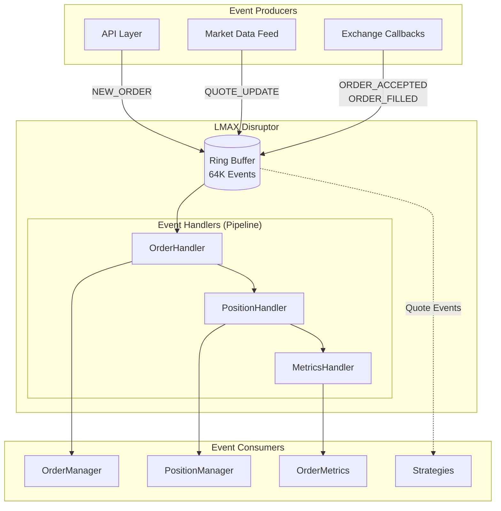
```mermaid
graph TB
    subgraph "Event Producers"
        API[API Layer]
        MD[Market Data Feed]
        EX[Exchange Callbacks]
    end

    subgraph "LMAX Disruptor"
        RB[(Ring Buffer<br/>64K Events)]

        subgraph "Event Handlers (Pipeline)"
            OH[OrderHandler]
            PH[PositionHandler]
            MH[MetricsHandler]
        end
    end

    subgraph "Event Consumers"
        OM[OrderManager]
        PM[PositionManager]
        METRICS[OrderMetrics]
        STRAT[Strategies]
    end

    API -->|NEW_ORDER| RB
    MD -->|QUOTE_UPDATE| RB
    EX -->|ORDER_ACCEPTED<br/>ORDER_FILLED| RB

    RB --> OH
    OH --> PH
    PH --> MH

    OH --> OM
    PH --> PM
    MH --> METRICS
    RB -.->|Quote Events| STRAT
```

### Event Types

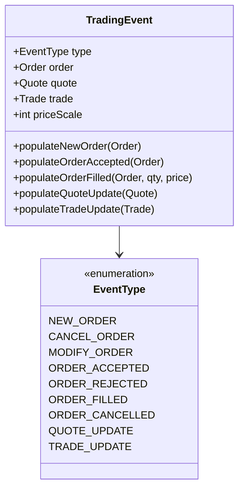
```mermaid
classDiagram
    class TradingEvent {
        +EventType type
        +Order order
        +Quote quote
        +Trade trade
        +int priceScale
        +populateNewOrder(Order)
        +populateOrderAccepted(Order)
        +populateOrderFilled(Order, qty, price)
        +populateQuoteUpdate(Quote)
        +populateTradeUpdate(Trade)
    }

    class EventType {
        <<enumeration>>
        NEW_ORDER
        CANCEL_ORDER
        MODIFY_ORDER
        ORDER_ACCEPTED
        ORDER_REJECTED
        ORDER_FILLED
        ORDER_CANCELLED
        QUOTE_UPDATE
        TRADE_UPDATE
    }

    TradingEvent --> EventType
```

---

## Sequence Diagrams

### Order Submission Flow

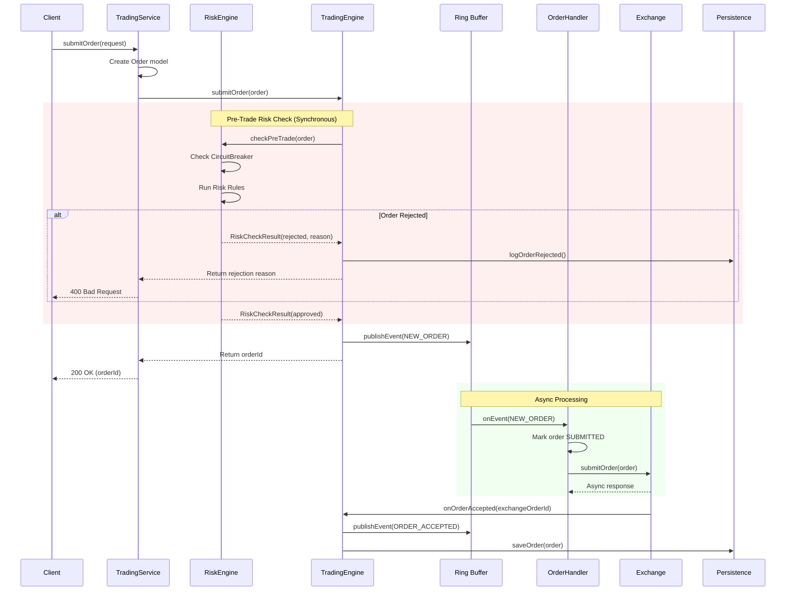
```mermaid
sequenceDiagram
    participant Client
    participant API as TradingService
    participant RE as RiskEngine
    participant TE as TradingEngine
    participant RB as Ring Buffer
    participant OH as OrderHandler
    participant EX as Exchange
    participant PER as Persistence

    Client->>API: submitOrder(request)
    API->>API: Create Order model
    API->>TE: submitOrder(order)

    rect rgb(255, 240, 240)
        Note over TE,RE: Pre-Trade Risk Check (Synchronous)
        TE->>RE: checkPreTrade(order)
        RE->>RE: Check CircuitBreaker
        RE->>RE: Run Risk Rules
        alt Order Rejected
            RE-->>TE: RiskCheckResult(rejected, reason)
            TE->>PER: logOrderRejected()
            TE-->>API: Return rejection reason
            API-->>Client: 400 Bad Request
        end
        RE-->>TE: RiskCheckResult(approved)
    end

    TE->>RB: publishEvent(NEW_ORDER)
    TE-->>API: Return orderId
    API-->>Client: 200 OK (orderId)

    rect rgb(240, 255, 240)
        Note over RB,EX: Async Processing
        RB->>OH: onEvent(NEW_ORDER)
        OH->>OH: Mark order SUBMITTED
        OH->>EX: submitOrder(order)
        EX-->>OH: Async response
    end

    EX->>TE: onOrderAccepted(exchangeOrderId)
    TE->>RB: publishEvent(ORDER_ACCEPTED)
    TE->>PER: saveOrder(order)
```

### Order Fill Processing

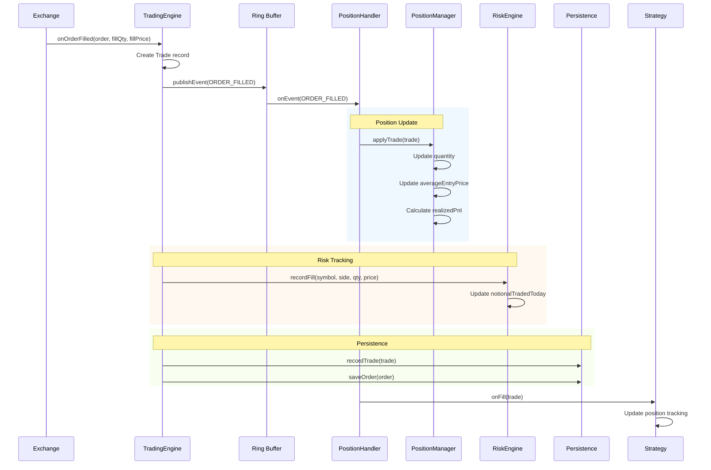
```mermaid
sequenceDiagram
    participant EX as Exchange
    participant TE as TradingEngine
    participant RB as Ring Buffer
    participant PH as PositionHandler
    participant PM as PositionManager
    participant RE as RiskEngine
    participant PER as Persistence
    participant STRAT as Strategy

    EX->>TE: onOrderFilled(order, fillQty, fillPrice)

    TE->>TE: Create Trade record
    TE->>RB: publishEvent(ORDER_FILLED)

    RB->>PH: onEvent(ORDER_FILLED)

    rect rgb(240, 248, 255)
        Note over PH,PM: Position Update
        PH->>PM: applyTrade(trade)
        PM->>PM: Update quantity
        PM->>PM: Update averageEntryPrice
        PM->>PM: Calculate realizedPnl
    end

    rect rgb(255, 248, 240)
        Note over TE,RE: Risk Tracking
        TE->>RE: recordFill(symbol, side, qty, price)
        RE->>RE: Update notionalTradedToday
    end

    rect rgb(248, 255, 240)
        Note over TE,PER: Persistence
        TE->>PER: recordTrade(trade)
        TE->>PER: saveOrder(order)
    end

    PH->>STRAT: onFill(trade)
    STRAT->>STRAT: Update position tracking
```

### Market Data Flow

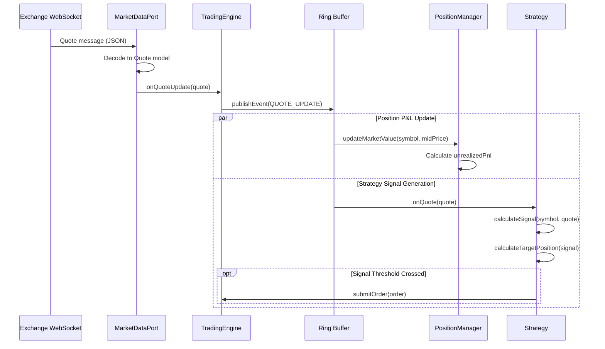
```mermaid
sequenceDiagram
    participant WS as Exchange WebSocket
    participant MD as MarketDataPort
    participant TE as TradingEngine
    participant RB as Ring Buffer
    participant PM as PositionManager
    participant STRAT as Strategy

    WS->>MD: Quote message (JSON)
    MD->>MD: Decode to Quote model
    MD->>TE: onQuoteUpdate(quote)
    TE->>RB: publishEvent(QUOTE_UPDATE)

    par Position P&L Update
        RB->>PM: updateMarketValue(symbol, midPrice)
        PM->>PM: Calculate unrealizedPnl
    and Strategy Signal Generation
        RB->>STRAT: onQuote(quote)
        STRAT->>STRAT: calculateSignal(symbol, quote)
        STRAT->>STRAT: calculateTargetPosition(signal)

        opt Signal Threshold Crossed
            STRAT->>TE: submitOrder(order)
        end
    end
```

### Risk Check Flow

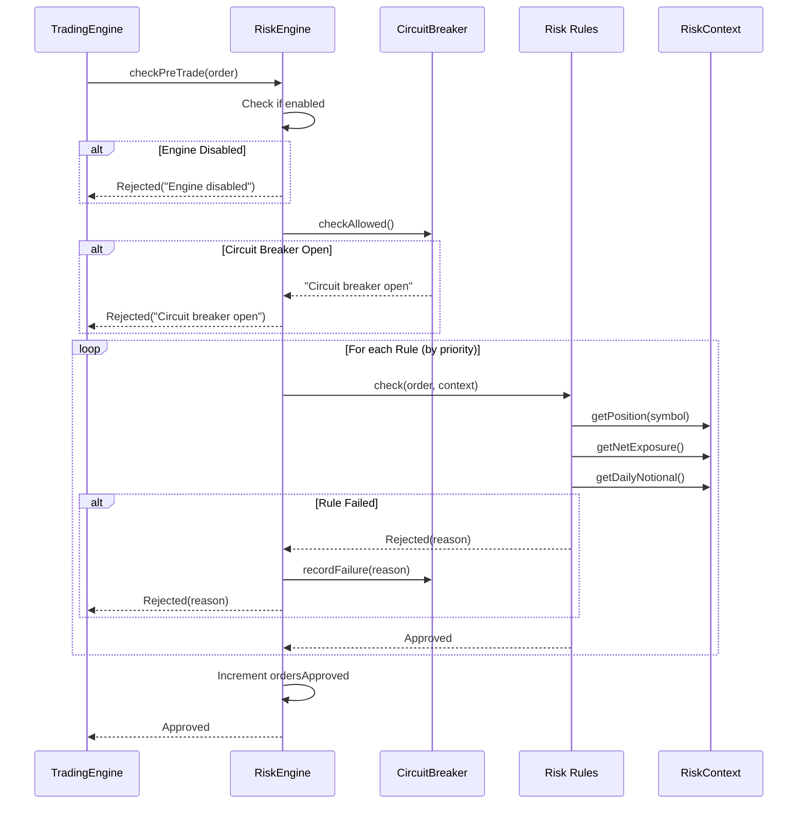
```mermaid
sequenceDiagram
    participant TE as TradingEngine
    participant RE as RiskEngine
    participant CB as CircuitBreaker
    participant Rules as Risk Rules
    participant CTX as RiskContext

    TE->>RE: checkPreTrade(order)

    RE->>RE: Check if enabled
    alt Engine Disabled
        RE-->>TE: Rejected("Engine disabled")
    end

    RE->>CB: checkAllowed()
    alt Circuit Breaker Open
        CB-->>RE: "Circuit breaker open"
        RE-->>TE: Rejected("Circuit breaker open")
    end

    loop For each Rule (by priority)
        RE->>Rules: check(order, context)
        Rules->>CTX: getPosition(symbol)
        Rules->>CTX: getNetExposure()
        Rules->>CTX: getDailyNotional()

        alt Rule Failed
            Rules-->>RE: Rejected(reason)
            RE->>CB: recordFailure(reason)
            RE-->>TE: Rejected(reason)
        end
        Rules-->>RE: Approved
    end

    RE->>RE: Increment ordersApproved
    RE-->>TE: Approved
```

---

## Exchange Connectivity

### Mode Switching and Credential Verification

The `ExchangeService` manages connections to exchanges with runtime mode switching (sandbox/testnet/live). Credentials are verified with actual API calls before reporting connected status.

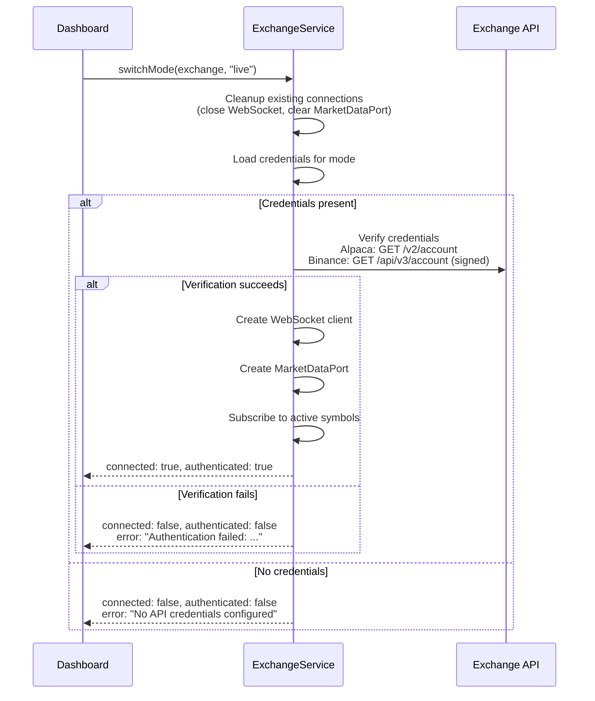
```mermaid
sequenceDiagram
    participant UI as Dashboard
    participant API as ExchangeService
    participant EX as Exchange API

    UI->>API: switchMode(exchange, "live")
    API->>API: Cleanup existing connections<br/>(close WebSocket, clear MarketDataPort)

    API->>API: Load credentials for mode

    alt Credentials present
        API->>EX: Verify credentials<br/>Alpaca: GET /v2/account<br/>Binance: GET /api/v3/account (signed)

        alt Verification succeeds
            API->>API: Create WebSocket client
            API->>API: Create MarketDataPort
            API->>API: Subscribe to active symbols
            API-->>UI: connected: true, authenticated: true
        else Verification fails
            API-->>UI: connected: false, authenticated: false<br/>error: "Authentication failed: ..."
        end
    else No credentials
        API-->>UI: connected: false, authenticated: false<br/>error: "No API credentials configured"
    end
```

### Exchange Modes

| Mode | Alpaca | Binance |
|------|--------|---------|
| **Sandbox** | Paper trading API with simulated fills | Testnet with simulated order book |
| **Live** | Real market data and execution | Real market data and execution |
| **Stub** | In-process simulated exchange (no network) | In-process simulated exchange (no network) |

Each exchange maintains an `ExchangeConnection` with: HTTP client, WebSocket client, MarketDataPort, OrderPort, connected/authenticated flags, and error message.

---

## Trading Algorithms

### Algorithm Class Hierarchy

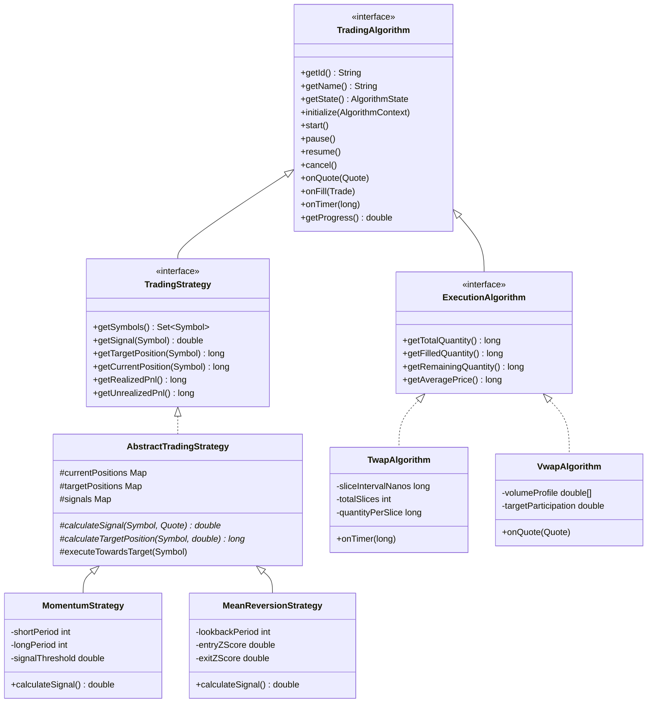
```mermaid
classDiagram
    class TradingAlgorithm {
        <<interface>>
        +getId() String
        +getName() String
        +getState() AlgorithmState
        +initialize(AlgorithmContext)
        +start()
        +pause()
        +resume()
        +cancel()
        +onQuote(Quote)
        +onFill(Trade)
        +onTimer(long)
        +getProgress() double
    }

    class TradingStrategy {
        <<interface>>
        +getSymbols() Set~Symbol~
        +getSignal(Symbol) double
        +getTargetPosition(Symbol) long
        +getCurrentPosition(Symbol) long
        +getRealizedPnl() long
        +getUnrealizedPnl() long
    }

    class ExecutionAlgorithm {
        <<interface>>
        +getTotalQuantity() long
        +getFilledQuantity() long
        +getRemainingQuantity() long
        +getAveragePrice() long
    }

    class AbstractTradingStrategy {
        #currentPositions Map
        #targetPositions Map
        #signals Map
        #calculateSignal(Symbol, Quote)* double
        #calculateTargetPosition(Symbol, double)* long
        #executeTowardsTarget(Symbol)
    }

    class MomentumStrategy {
        -shortPeriod int
        -longPeriod int
        -signalThreshold double
        +calculateSignal() double
    }

    class MeanReversionStrategy {
        -lookbackPeriod int
        -entryZScore double
        -exitZScore double
        +calculateSignal() double
    }

    class TwapAlgorithm {
        -sliceIntervalNanos long
        -totalSlices int
        -quantityPerSlice long
        +onTimer(long)
    }

    class VwapAlgorithm {
        -volumeProfile double[]
        -targetParticipation double
        +onQuote(Quote)
    }

    TradingAlgorithm <|-- TradingStrategy
    TradingAlgorithm <|-- ExecutionAlgorithm
    TradingStrategy <|.. AbstractTradingStrategy
    AbstractTradingStrategy <|-- MomentumStrategy
    AbstractTradingStrategy <|-- MeanReversionStrategy
    ExecutionAlgorithm <|.. TwapAlgorithm
    ExecutionAlgorithm <|.. VwapAlgorithm
```

### VWAP (Volume-Weighted Average Price) Algorithm

VWAP executes large orders by tracking the market's volume profile and participating proportionally.

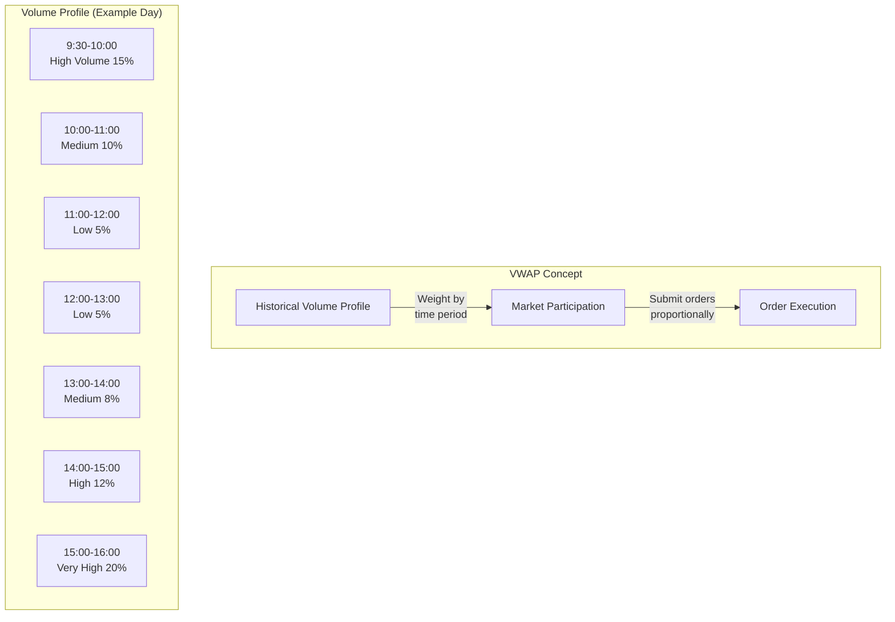
```mermaid
graph TB
    subgraph "VWAP Concept"
        VP[Historical Volume Profile]
        MP[Market Participation]
        EX[Order Execution]
    end

    VP -->|"Weight by<br/>time period"| MP
    MP -->|"Submit orders<br/>proportionally"| EX

    subgraph "Volume Profile (Example Day)"
        H1[9:30-10:00<br/>High Volume 15%]
        H2[10:00-11:00<br/>Medium 10%]
        H3[11:00-12:00<br/>Low 5%]
        H4[12:00-13:00<br/>Low 5%]
        H5[13:00-14:00<br/>Medium 8%]
        H6[14:00-15:00<br/>High 12%]
        H7[15:00-16:00<br/>Very High 20%]
    end
```

**VWAP Execution Logic:**

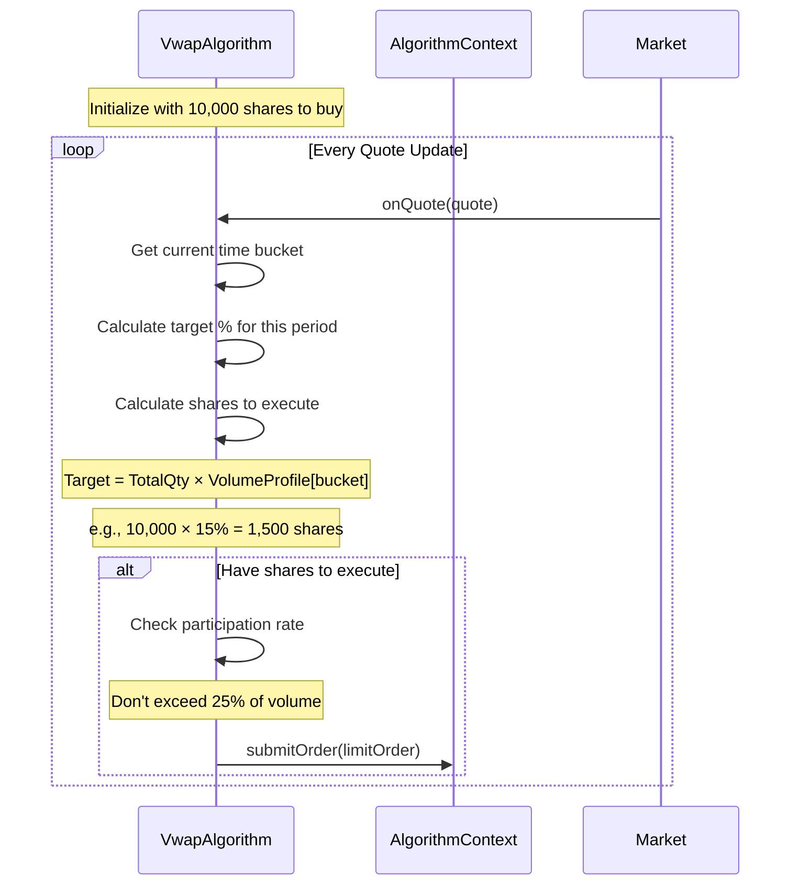
```mermaid
sequenceDiagram
    participant VWAP as VwapAlgorithm
    participant CTX as AlgorithmContext
    participant MKT as Market

    Note over VWAP: Initialize with 10,000 shares to buy

    loop Every Quote Update
        MKT->>VWAP: onQuote(quote)
        VWAP->>VWAP: Get current time bucket
        VWAP->>VWAP: Calculate target % for this period
        VWAP->>VWAP: Calculate shares to execute

        Note over VWAP: Target = TotalQty × VolumeProfile[bucket]
        Note over VWAP: e.g., 10,000 × 15% = 1,500 shares

        alt Have shares to execute
            VWAP->>VWAP: Check participation rate
            Note over VWAP: Don't exceed 25% of volume
            VWAP->>CTX: submitOrder(limitOrder)
        end
    end
```

**VWAP Formula:**

```
VWAP = Σ(Price × Volume) / Σ(Volume)

Target Execution = TotalQuantity × VolumeProfile[currentPeriod]
Participation Rate = min(OrderQuantity / AvailableVolume, MaxParticipation)
```

### TWAP (Time-Weighted Average Price) Algorithm

TWAP divides an order into equal time slices, executing evenly throughout the period.

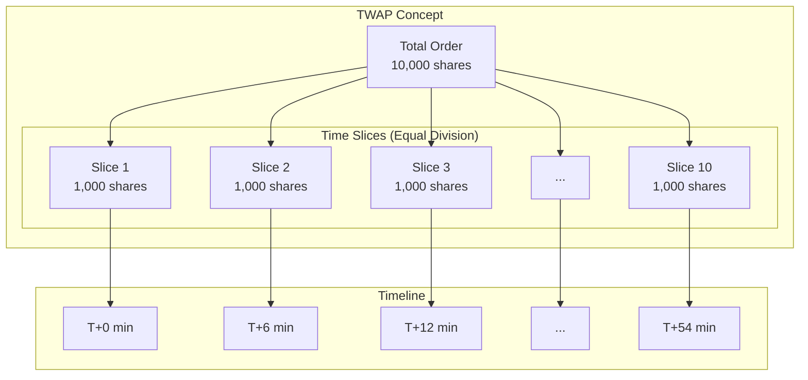
```mermaid
graph TB
    subgraph "TWAP Concept"
        TO[Total Order<br/>10,000 shares]

        subgraph "Time Slices (Equal Division)"
            S1[Slice 1<br/>1,000 shares]
            S2[Slice 2<br/>1,000 shares]
            S3[Slice 3<br/>1,000 shares]
            S4[...]
            S10[Slice 10<br/>1,000 shares]
        end

        TO --> S1
        TO --> S2
        TO --> S3
        TO --> S4
        TO --> S10
    end

    subgraph "Timeline"
        T1[T+0 min]
        T2[T+6 min]
        T3[T+12 min]
        T4[...]
        T10[T+54 min]
    end

    S1 --> T1
    S2 --> T2
    S3 --> T3
    S4 --> T4
    S10 --> T10
```

**TWAP Execution Logic:**

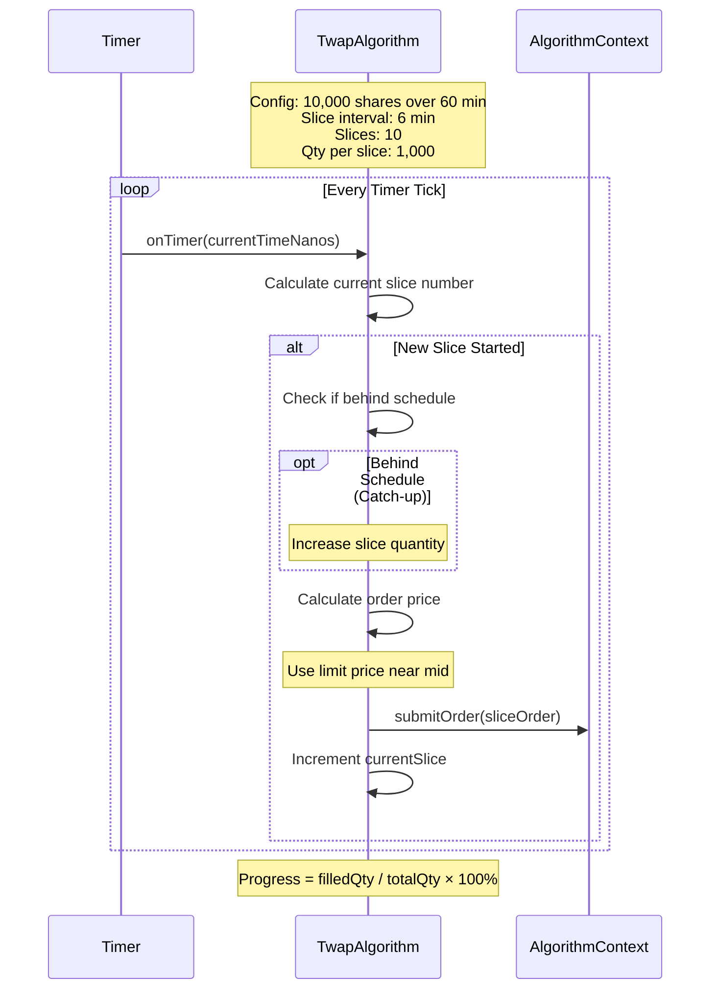
```mermaid
sequenceDiagram
    participant Timer
    participant TWAP as TwapAlgorithm
    participant CTX as AlgorithmContext

    Note over TWAP: Config: 10,000 shares over 60 min<br/>Slice interval: 6 min<br/>Slices: 10<br/>Qty per slice: 1,000

    loop Every Timer Tick
        Timer->>TWAP: onTimer(currentTimeNanos)
        TWAP->>TWAP: Calculate current slice number

        alt New Slice Started
            TWAP->>TWAP: Check if behind schedule

            opt Behind Schedule (Catch-up)
                Note over TWAP: Increase slice quantity
            end

            TWAP->>TWAP: Calculate order price
            Note over TWAP: Use limit price near mid
            TWAP->>CTX: submitOrder(sliceOrder)
            TWAP->>TWAP: Increment currentSlice
        end
    end

    Note over TWAP: Progress = filledQty / totalQty × 100%
```

**TWAP Formula:**

```
SliceQuantity = TotalQuantity / NumberOfSlices
SliceInterval = TotalDuration / NumberOfSlices
CatchUpQuantity = max(0, ExpectedFilled - ActualFilled)
```

### Momentum Strategy

Momentum strategy follows trends by buying assets with upward price momentum and selling those with downward momentum.

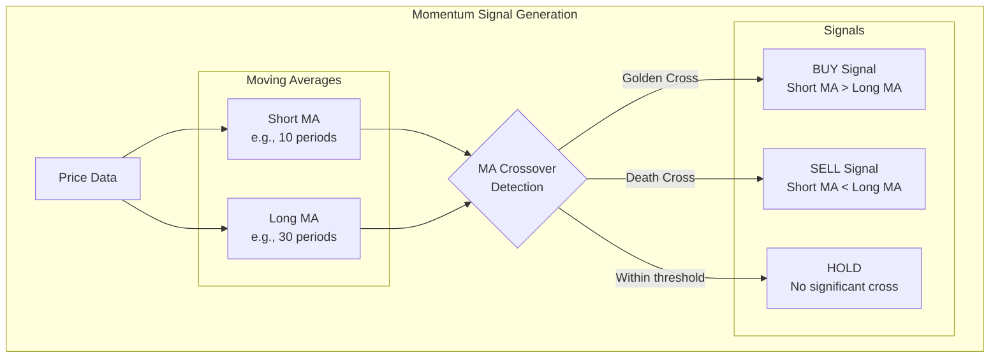
```mermaid
graph TB
    subgraph "Momentum Signal Generation"
        PRICE[Price Data]

        subgraph "Moving Averages"
            SMA[Short MA<br/>e.g., 10 periods]
            LMA[Long MA<br/>e.g., 30 periods]
        end

        PRICE --> SMA
        PRICE --> LMA

        CROSS{MA Crossover<br/>Detection}
        SMA --> CROSS
        LMA --> CROSS

        subgraph "Signals"
            BUY[BUY Signal<br/>Short MA > Long MA]
            SELL[SELL Signal<br/>Short MA < Long MA]
            HOLD[HOLD<br/>No significant cross]
        end

        CROSS -->|Golden Cross| BUY
        CROSS -->|Death Cross| SELL
        CROSS -->|Within threshold| HOLD
    end
```

**Momentum Signal Visualization:**

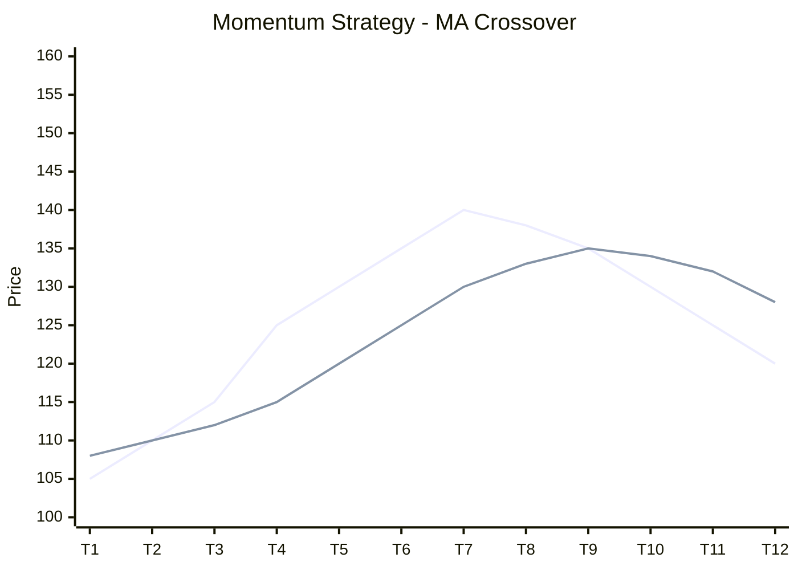
```mermaid
xychart-beta
    title "Momentum Strategy - MA Crossover"
    x-axis [T1, T2, T3, T4, T5, T6, T7, T8, T9, T10, T11, T12]
    y-axis "Price" 100 --> 160
    line [105, 110, 115, 125, 130, 135, 140, 138, 135, 130, 125, 120]
    line [108, 110, 112, 115, 120, 125, 130, 133, 135, 134, 132, 128]
```

*Blue: Price, Orange: Long MA - Buy when price crosses above MA, Sell when below*

**Momentum Strategy Logic:**

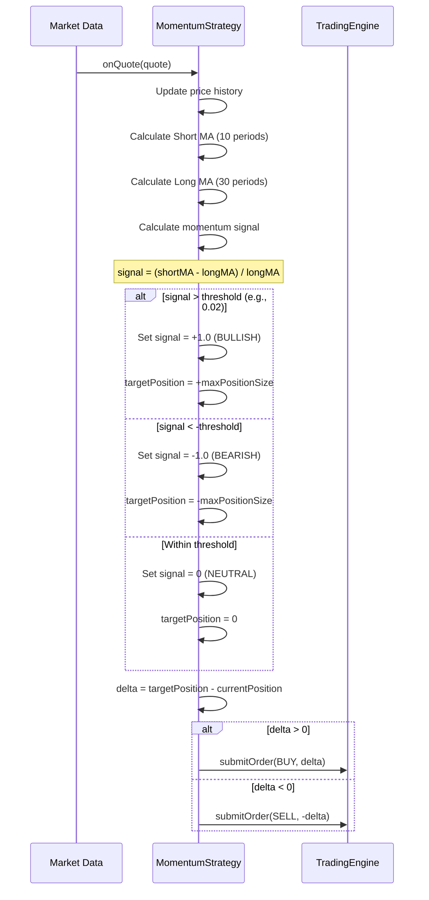
```mermaid
sequenceDiagram
    participant MKT as Market Data
    participant MOM as MomentumStrategy
    participant TE as TradingEngine

    MKT->>MOM: onQuote(quote)
    MOM->>MOM: Update price history
    MOM->>MOM: Calculate Short MA (10 periods)
    MOM->>MOM: Calculate Long MA (30 periods)

    MOM->>MOM: Calculate momentum signal
    Note over MOM: signal = (shortMA - longMA) / longMA

    alt signal > threshold (e.g., 0.02)
        MOM->>MOM: Set signal = +1.0 (BULLISH)
        MOM->>MOM: targetPosition = +maxPositionSize
    else signal < -threshold
        MOM->>MOM: Set signal = -1.0 (BEARISH)
        MOM->>MOM: targetPosition = -maxPositionSize
    else Within threshold
        MOM->>MOM: Set signal = 0 (NEUTRAL)
        MOM->>MOM: targetPosition = 0
    end

    MOM->>MOM: delta = targetPosition - currentPosition

    alt delta > 0
        MOM->>TE: submitOrder(BUY, delta)
    else delta < 0
        MOM->>TE: submitOrder(SELL, -delta)
    end
```

**Momentum Formula:**

```
ShortMA = Σ(Price[t-shortPeriod:t]) / shortPeriod
LongMA = Σ(Price[t-longPeriod:t]) / longPeriod

MomentumSignal = (ShortMA - LongMA) / LongMA

if MomentumSignal > threshold:   signal = +1.0 (BUY)
if MomentumSignal < -threshold:  signal = -1.0 (SELL)
else:                            signal = 0.0 (HOLD)
```

### Mean Reversion Strategy

Mean reversion assumes prices will revert to their historical mean, buying when prices are unusually low and selling when unusually high.

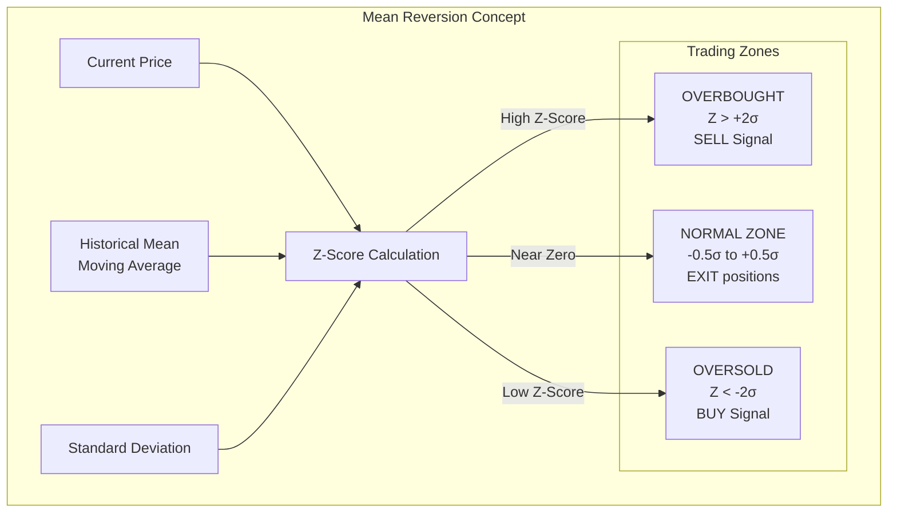
```mermaid
graph TB
    subgraph "Mean Reversion Concept"
        PRICE[Current Price]
        MEAN[Historical Mean<br/>Moving Average]
        STD[Standard Deviation]

        PRICE --> ZSCORE
        MEAN --> ZSCORE
        STD --> ZSCORE

        ZSCORE[Z-Score Calculation]

        subgraph "Trading Zones"
            OVERBOUGHT[OVERBOUGHT<br/>Z > +2σ<br/>SELL Signal]
            NORMAL[NORMAL ZONE<br/>-0.5σ to +0.5σ<br/>EXIT positions]
            OVERSOLD[OVERSOLD<br/>Z < -2σ<br/>BUY Signal]
        end

        ZSCORE -->|High Z-Score| OVERBOUGHT
        ZSCORE -->|Near Zero| NORMAL
        ZSCORE -->|Low Z-Score| OVERSOLD
    end
```

**Mean Reversion Bands:**

```mermaid
xychart-beta
    title "Mean Reversion - Bollinger Band Style"
    x-axis [T1, T2, T3, T4, T5, T6, T7, T8, T9, T10, T11, T12]
    y-axis "Price" 90 --> 130
    line [100, 105, 115, 120, 118, 112, 105, 95, 92, 98, 105, 110]
    line [108, 108, 108, 108, 108, 108, 108, 108, 108, 108, 108, 108]
    line [120, 120, 120, 120, 120, 120, 120, 120, 120, 120, 120, 120]
    line [96, 96, 96, 96, 96, 96, 96, 96, 96, 96, 96, 96]
```

*Blue: Price, Orange: Mean, Green: Upper Band (+2σ), Red: Lower Band (-2σ)*

**Mean Reversion Strategy Logic:**

```mermaid
sequenceDiagram
    participant MKT as Market Data
    participant MR as MeanReversionStrategy
    participant TE as TradingEngine

    MKT->>MR: onQuote(quote)
    MR->>MR: Update price history (lookback = 20)
    MR->>MR: Calculate Mean (SMA)
    MR->>MR: Calculate Standard Deviation

    MR->>MR: Calculate Z-Score
    Note over MR: Z = (price - mean) / stdDev

    alt Z-Score < -entryZScore (e.g., -2.0)
        Note over MR: Price is 2σ below mean - OVERSOLD
        MR->>MR: signal = +1.0 (BUY)
        MR->>MR: targetPosition = +maxPositionSize
    else Z-Score > +entryZScore (e.g., +2.0)
        Note over MR: Price is 2σ above mean - OVERBOUGHT
        MR->>MR: signal = -1.0 (SELL)
        MR->>MR: targetPosition = -maxPositionSize
    else |Z-Score| < exitZScore (e.g., 0.5)
        Note over MR: Price returned to mean - EXIT
        MR->>MR: signal = 0
        MR->>MR: targetPosition = 0
    else
        Note over MR: Between entry and exit - HOLD
        MR->>MR: Keep current position
    end

    MR->>MR: delta = targetPosition - currentPosition

    alt delta != 0
        MR->>TE: submitOrder(side, |delta|)
    end
```

**Mean Reversion Formulas:**

```
Mean = Σ(Price[t-lookback:t]) / lookback
StdDev = √(Σ(Price - Mean)² / lookback)

Z-Score = (CurrentPrice - Mean) / StdDev

Entry Condition (BUY):  Z-Score < -entryZScore  (e.g., -2.0)
Entry Condition (SELL): Z-Score > +entryZScore  (e.g., +2.0)
Exit Condition:         |Z-Score| < exitZScore  (e.g., 0.5)
```

---

## Risk Management

### Risk Engine Architecture

```mermaid
graph TB
    subgraph "RiskEngine"
        ENABLED[Enabled Flag]
        RULES[Risk Rules Chain]
        CB[Circuit Breaker]
        COUNTERS[Daily Counters]
    end

    subgraph "Risk Rules (Priority Order)"
        R1[1. MaxOrderSizeRule]
        R2[2. MaxOrderNotionalRule]
        R3[3. MaxPositionSizeRule]
        R4[4. MaxNetExposureRule]
        R5[5. MaxGrossExposureRule]
        R6[6. MaxDailyOrdersRule]
        R7[7. MaxDailyNotionalRule]
        R8[8. MaxDailyLossRule]
    end

    subgraph "RiskContext (State)"
        POS[Position Data]
        PNL[P&L Data]
        EXP[Exposure Data]
        DAILY[Daily Counters]
    end

    ORDER[Incoming Order] --> ENABLED
    ENABLED -->|Disabled| REJECT1[Reject: Disabled]
    ENABLED -->|Enabled| CB
    CB -->|Open| REJECT2[Reject: Circuit Breaker]
    CB -->|Closed| RULES

    RULES --> R1
    R1 --> R2
    R2 --> R3
    R3 --> R4
    R4 --> R5
    R5 --> R6
    R6 --> R7
    R7 --> R8
    R8 --> APPROVE[Approved]

    R1 -.->|Query| POS
    R3 -.->|Query| POS
    R4 -.->|Query| EXP
    R5 -.->|Query| EXP
    R6 -.->|Query| DAILY
    R7 -.->|Query| DAILY
    R8 -.->|Query| PNL
```

### Circuit Breaker State Machine

```mermaid
stateDiagram-v2
    [*] --> CLOSED: Initialize

    CLOSED --> OPEN: Failure threshold exceeded
    CLOSED --> CLOSED: Success / Under threshold

    OPEN --> HALF_OPEN: Cooldown period elapsed
    OPEN --> OPEN: Within cooldown

    HALF_OPEN --> CLOSED: Test order succeeds
    HALF_OPEN --> OPEN: Test order fails

    note right of CLOSED: Normal operation<br/>All orders processed
    note right of OPEN: Trading halted<br/>All orders rejected
    note right of HALF_OPEN: Testing recovery<br/>Limited orders allowed
```

### Risk Limits Configuration

**Important:** All monetary limits are stored in **cents (scale 100)** for consistent comparison across exchanges with different price scales. See [Price Scale Handling](#price-scale-handling) for details on how P&L values are normalized before comparison.

```mermaid
classDiagram
    class RiskLimits {
        +long maxOrderSize
        +long maxOrderNotional
        +long maxPositionSize
        +long maxNetExposure
        +long maxGrossExposure
        +long maxDailyOrders
        +long maxDailyNotional
        +long maxDailyLoss
        +defaults() RiskLimits
        +conservative() RiskLimits
        +forTesting() RiskLimits
    }

    class DefaultLimits {
        maxOrderSize = 10,000
        maxOrderNotional = 1,000,000
        maxPositionSize = 50,000
        maxNetExposure = 5,000,000
        maxGrossExposure = 10,000,000
        maxDailyOrders = 10,000
        maxDailyNotional = 50,000,000
        maxDailyLoss = 100,000
    }

    class ConservativeLimits {
        maxOrderSize = 1,000
        maxOrderNotional = 100,000
        maxPositionSize = 5,000
        maxNetExposure = 500,000
        maxGrossExposure = 1,000,000
        maxDailyOrders = 1,000
        maxDailyNotional = 5,000,000
        maxDailyLoss = 10,000
    }

    RiskLimits <|-- DefaultLimits
    RiskLimits <|-- ConservativeLimits
```

---

## Persistence Layer

### Chronicle Queue Architecture

```mermaid
graph TB
    subgraph "PersistenceManager"
        PM[PersistenceManager]
    end

    subgraph "Chronicle Queue Stores"
        TJ[ChronicleTradeJournal]
        OR[ChronicleOrderRepository]
        PS[ChroniclePositionSnapshotStore]
        SR[ChronicleStrategyRepository]
        AL[ChronicleAuditLog]
    end

    subgraph "Wire Format (Serialization)"
        TW[TradeWire]
        OW[OrderWire]
        PW[PositionSnapshotWire]
        SW[StrategyWire]
        AW[AuditEventWire]
    end

    subgraph "Memory-Mapped Files"
        TF[(trades/<br/>20260119F.cq4)]
        OF[(orders/<br/>20260119F.cq4)]
        PF[(positions/<br/>20260119F.cq4)]
        SF[(strategies/<br/>20260119F.cq4)]
        AF[(audit/<br/>20260119F.cq4)]
    end

    PM --> TJ
    PM --> OR
    PM --> PS
    PM --> SR
    PM --> AL

    TJ --> TW
    OR --> OW
    PS --> PW
    SR --> SW
    AL --> AW

    TW --> TF
    OW --> OF
    PW --> PF
    SW --> SF
    AW --> AF

    subgraph "Features"
        F1[Zero-GC Writes]
        F2[Memory-Mapped I/O]
        F3[Daily Rolling Files]
        F4[Replay Capability]
    end
```

### Store Implementations

Each Chronicle store follows the same pattern: writes go to a Chronicle Queue (memory-mapped file) for durability, while in-memory indices (ConcurrentHashMap) provide O(1) lookups. On startup, `rebuildIndex()` replays the queue to reconstruct in-memory state.

| Store | Queue Directory | In-Memory Indices | Key Operations |
|-------|----------------|-------------------|----------------|
| `ChronicleOrderRepository` | `orders/` | byClientId, byExchangeId, recentOrders (Deque) | save, findByClientOrderId, getActiveOrders, replay |
| `ChronicleTradeJournal` | `trades/` | recentTrades (Deque), tradeCount | record, getTradesForDate, getRecentTrades |
| `ChroniclePositionSnapshotStore` | `positions/` | latestBySymbol, snapshotsBySymbol, eodSnapshots | saveSnapshot, getLatestSnapshot, getAllLatestSnapshots |
| `ChronicleStrategyRepository` | `strategies/` | strategiesById | save, findById, findAll, delete (logical) |
| `ChronicleAuditLog` | `audit/` | recentEvents (Deque) | log, getEventsForDate, getRecentEvents |

`PersistenceManager` provides three factory methods:
- `inMemory()` — All in-memory implementations (for testing)
- `fileBased(Path)` — File-based trade journal/audit + Chronicle positions
- `chronicle(Path)` — All Chronicle Queue implementations (production)

### Persistence Flow

```mermaid
sequenceDiagram
    participant TE as TradingEngine
    participant TS as TradingService
    participant PM as PersistenceManager
    participant TJ as TradeJournal
    participant OR as OrderRepository
    participant PS as PositionStore
    participant SR as StrategyRepository
    participant AL as AuditLog
    participant CQ as Chronicle Queue

    Note over TE,CQ: Order Submission
    TE->>PM: logOrderSubmitted(order)
    PM->>AL: log(ORDER_SUBMITTED, details)
    AL->>CQ: writeDocument(AuditEventWire)

    Note over TE,CQ: Order State Change
    TS->>OR: save(order)
    OR->>CQ: writeDocument(OrderWire)

    Note over TE,CQ: Order Fill
    TE->>PM: recordTrade(trade)
    PM->>TJ: record(trade)
    TJ->>CQ: writeDocument(TradeWire)
    PM->>AL: log(ORDER_FILLED, details)

    Note over TE,CQ: Position Update (via listener)
    TS->>PS: saveSnapshot(position, timestampNanos)
    PS->>CQ: writeDocument(PositionSnapshotWire)

    Note over TE,CQ: Strategy Created
    TS->>SR: save(strategyDefinition)
    SR->>CQ: writeDocument(StrategyWire)
```

### Startup Restoration Flow

On application startup, `TradingService.init()` restores persisted state from Chronicle Queue stores in order:

```mermaid
sequenceDiagram
    participant TS as TradingService
    participant PS as PositionSnapshotStore
    participant PM as PositionManager
    participant OR as OrderRepository
    participant OM as OrderManager
    participant SR as StrategyRepository
    participant SM as StrategyManager

    Note over TS,SM: @PostConstruct init()

    rect rgb(240, 248, 255)
        Note over TS,PM: 1. Restore Positions
        TS->>PS: getAllLatestSnapshots()
        PS-->>TS: Map<Symbol, PositionSnapshot>
        loop Each non-flat position (qty != 0)
            TS->>PM: restorePosition(symbol, qty, avgPrice, ...)
            PM->>PM: Populate Position fields via setters
        end
    end

    rect rgb(248, 255, 240)
        Note over TS,OM: 2. Restore Orders
        TS->>OR: findAll()
        OR-->>TS: Collection<Order>
        loop Each order
            TS->>OM: trackOrder(order)
        end
    end

    rect rgb(255, 248, 240)
        Note over TS,SM: 3. Restore Strategies
        TS->>SR: findAll()
        SR-->>TS: List<StrategyDefinition>
        loop Each strategy definition
            TS->>TS: createStrategyFromDefinition(type, params)
            TS->>SM: Register strategy instance
        end
    end
```

### Audit Event Types

```mermaid
graph LR
    subgraph "Audit Event Categories"
        subgraph "Engine Events"
            E1[ENGINE_STARTED]
            E2[ENGINE_STOPPED]
        end

        subgraph "Strategy Events"
            S1[STRATEGY_STARTED]
            S2[STRATEGY_STOPPED]
        end

        subgraph "Order Events"
            O1[ORDER_SUBMITTED]
            O2[ORDER_REJECTED]
            O3[ORDER_FILLED]
        end

        subgraph "Risk Events"
            R1[RISK_CHECK_FAILED]
            R2[CIRCUIT_BREAKER_TRIPPED]
            R3[TRADING_DISABLED]
        end

        subgraph "Position Events"
            P1[POSITION_UPDATED]
        end

        subgraph "System Events"
            SYS[ERROR]
        end
    end
```

---

## Frontend (hft-ui)

### React Application Architecture

The frontend is a React + TypeScript SPA bundled with Vite, served as static assets from Spring Boot.

```mermaid
graph TB
    subgraph "React Application (hft-ui)"
        subgraph "Pages"
            DASH[Dashboard]
            OH[Order History]
            RL[Risk Limits]
        end

        subgraph "Dashboard Components"
            ES[EngineStatus<br/>Start/Stop controls]
            ESP[ExchangeStatusPanel<br/>Mode switching]
            SF[StrategyForm<br/>Create strategy]
            SL[StrategyList<br/>Manage strategies]
            SI[StrategyInspector<br/>Strategy details modal]
            CP[ChartPanel<br/>Symbol selector]
            CC[CandlestickChart<br/>Lightweight Charts]
            PL[PositionList<br/>Current positions]
            OL[OrderList<br/>Recent orders]
        end

        subgraph "Hooks"
            UA[useApi<br/>REST client]
            UWS[useWebSocket<br/>STOMP client]
        end
    end

    subgraph "Backend"
        REST[REST API<br/>:8080/api/*]
        WS[WebSocket<br/>STOMP /ws]
    end

    UA --> REST
    UWS --> WS

    DASH --> ES
    DASH --> ESP
    DASH --> SF
    DASH --> SL
    DASH --> CP
    CP --> CC
    DASH --> PL
    DASH --> OL
```

### Real-Time Data Flow

The UI receives live updates via WebSocket STOMP subscriptions:

| Topic | Data | Used By |
|-------|------|---------|
| `/topic/engine/status` | EngineStatus | EngineStatus component |
| `/topic/orders` | Order updates | OrderList (upsert by clientOrderId) |
| `/topic/positions` | Position updates | PositionList (upsert by symbol+exchange) |
| `/topic/strategies` | Strategy updates | StrategyList (upsert by id) |
| `/topic/quotes/{exchange}/{ticker}` | Live quotes | CandlestickChart (real-time candle updates) |

### State Persistence

- **Chart selection** (exchange + symbol) persisted to `localStorage` across browser sessions
- **Exchange status** and **risk limits** polled every 5 seconds
- Initial data loaded via REST on mount, then kept current via WebSocket

---

## Testing Strategy

The system uses a comprehensive testing approach with BDD (Behavior-Driven Development) for end-to-end orchestration validation.

### Test Categories

```mermaid
graph TB
    subgraph "Test Pyramid"
        E2E[E2E Orchestration Tests<br/>Cucumber BDD]
        INT[Integration Tests<br/>Component Interaction]
        UNIT[Unit Tests<br/>JUnit 5]
        PERF[Performance Tests<br/>JMH Benchmarks]
    end

    E2E --> INT
    INT --> UNIT
    PERF -.-> UNIT
```

### End-to-End Orchestration Scenarios

The BDD tests in `hft-bdd` module validate complete system flows:

#### Signal to Order Flow
```mermaid
sequenceDiagram
    participant Market
    participant Strategy
    participant Engine
    participant Risk
    participant Persistence

    Market->>Strategy: Price Update (Quote)
    Strategy->>Strategy: Calculate Signal
    Strategy->>Engine: Generate Order
    Engine->>Risk: Pre-Trade Check
    Risk-->>Engine: Approved/Rejected
    Engine->>Persistence: Log Event
```

#### Risk Rejection Scenarios
Tests verify that orders are properly rejected when:
- Order size exceeds maximum (`MaxOrderSizeRule`)
- Position size would exceed maximum (`MaxPositionSizeRule`)
- Daily notional limit exceeded (`MaxDailyNotionalRule`)
- Daily loss limit breached (`MaxDailyLossRule`)
- Net/Gross exposure limits exceeded

#### Position and P&L Tracking
```mermaid
sequenceDiagram
    participant Order
    participant Engine
    participant Position
    participant PnL

    Order->>Engine: Order Filled
    Engine->>Position: Update Position
    Position->>Position: Calculate Avg Entry
    Position->>PnL: Calculate Unrealized
    Engine->>Engine: Price Update
    PnL->>PnL: Recalculate P&L
```

### Running Tests

```bash
# Run all BDD tests
./gradlew :hft-bdd:test

# Run E2E orchestration tests only
./gradlew :hft-bdd:test --tests '*EndToEnd*'

# Run performance benchmarks
./gradlew :hft-bdd:test --tests '*Performance*'
```

### Key Test Scenarios

| Scenario Group | Description |
|----------------|-------------|
| Signal → Order | Market signals flow through strategies to generate orders |
| Risk Rejection | Orders blocked by various risk limits |
| Circuit Breaker | Trading halted after repeated rejections |
| Fill → P&L | Order fills update positions and calculate P&L |
| Persistence | All events recorded in audit log and trade journal |
| Engine State | State snapshots and daily resets |

---

## Summary

This HFT trading system provides:

1. **Ultra-Low Latency**: LMAX Disruptor with 64K ring buffer, zero-allocation object pooling
2. **Comprehensive Risk Management**: Pluggable rules, circuit breaker, daily limits with normalized P&L comparison
3. **Multi-Exchange Support**: Alpaca (stocks, 2 decimal places) and Binance (crypto, 8 decimal places) with unified price scale handling and credential verification
4. **Advanced Algorithms**: VWAP, TWAP execution; Momentum, Mean Reversion strategies
5. **Full Persistence**: Chronicle Queue stores for orders, trades, positions, strategies, and audit events with automatic startup restoration
6. **Real-Time Dashboard**: React UI with WebSocket-driven live updates, interactive candlestick charts, and strategy management
7. **Real-Time Position Tracking**: P&L, exposure, and drawdown calculations across different price scales, persisted across restarts
8. **Event-Driven Architecture**: Clean separation of concerns with hexagonal design

The architecture balances:
- **Performance**: Nanosecond latency, lock-free structures
- **Safety**: Pre-trade risk checks, circuit breakers
- **Durability**: All state persisted to Chronicle Queue, restored on startup
- **Flexibility**: Pluggable components, multiple exchange support with runtime mode switching
- **Accuracy**: Integer arithmetic with configurable price scales prevents floating-point errors
- **Compliance**: Complete audit logging, position tracking
