# HFT Client Architecture Documentation

This document provides visual documentation of the HFT trading system architecture, including component interactions, sequence diagrams for main operations, and explanations of trading algorithms.

## Table of Contents

1. [System Architecture Overview](#system-architecture-overview)
2. [Module Structure](#module-structure)
3. [Component Interactions](#component-interactions)
4. [Sequence Diagrams](#sequence-diagrams)
5. [Trading Algorithms](#trading-algorithms)
6. [Risk Management](#risk-management)
7. [Persistence Layer](#persistence-layer)

---

## System Architecture Overview

The system follows **Hexagonal Architecture** (Ports & Adapters) with a high-performance event-driven core using LMAX Disruptor.

```mermaid
graph TB
    subgraph "External Clients"
        WEB[Web UI]
        REST[REST API Clients]
        WS[WebSocket Clients]
    end

    subgraph "API Layer"
        API[Spring Boot API<br/>hft-api]
        WSH[WebSocket Handler]
    end

    subgraph "Application Services"
        TS[TradingService]
        SM[StrategyManager]
    end

    subgraph "Domain Core"
        subgraph "Trading Engine (hft-engine)"
            TE[TradingEngine<br/>LMAX Disruptor]
            OM[OrderManager]
            PM[PositionManager]
            RB[(Ring Buffer<br/>64K events)]
        end

        subgraph "Algorithms (hft-algo)"
            VWAP[VWAP Algorithm]
            TWAP[TWAP Algorithm]
            MOM[Momentum Strategy]
            MR[Mean Reversion Strategy]
        end

        subgraph "Risk Management (hft-risk)"
            RE[RiskEngine]
            CB[CircuitBreaker]
            RR[Risk Rules]
        end
    end

    subgraph "Infrastructure Adapters"
        subgraph "Exchange Adapters"
            ALP[Alpaca Adapter<br/>hft-exchange-alpaca]
            BIN[Binance Adapter<br/>hft-exchange-binance]
        end

        subgraph "Persistence (hft-persistence)"
            PER[PersistenceManager]
            CQ[(Chronicle Queue)]
        end
    end

    subgraph "External Systems"
        ALPACA[Alpaca API]
        BINANCE[Binance API]
    end

    WEB --> API
    REST --> API
    WS --> WSH

    API --> TS
    WSH --> TS
    TS --> SM
    TS --> TE

    SM --> VWAP
    SM --> TWAP
    SM --> MOM
    SM --> MR

    TE --> RB
    TE --> OM
    TE --> PM
    TE --> RE

    RE --> CB
    RE --> RR

    TE --> ALP
    TE --> BIN
    TE --> PER

    ALP --> ALPACA
    BIN --> BINANCE
    PER --> CQ

    VWAP --> TE
    TWAP --> TE
    MOM --> TE
    MR --> TE
```



---

## Module Structure


### Module Responsibilities

| Module | Responsibility |
|--------|---------------|
| `hft-core` | Domain models (Order, Quote, Position, Trade), port interfaces |
| `hft-algo` | Trading algorithms (VWAP, TWAP) and strategies (Momentum, Mean Reversion) |
| `hft-risk` | Risk engine, circuit breaker, configurable risk rules |
| `hft-engine` | LMAX Disruptor event processing, order/position management |
| `hft-exchange-api` | Exchange port interface definitions |
| `hft-exchange-alpaca` | Alpaca REST/WebSocket adapter |
| `hft-exchange-binance` | Binance REST/WebSocket adapter |
| `hft-persistence` | Chronicle Queue based persistence |
| `hft-api` | Spring Boot REST and WebSocket API |
| `hft-app` | Application assembly and configuration |
| `hft-bdd` | Cucumber BDD tests and JMH benchmarks |

---

## Component Interactions

### Event-Driven Architecture


### Event Types


---

## Sequence Diagrams

### Order Submission Flow


### Order Fill Processing


### Market Data Flow


### Risk Check Flow


---

## Trading Algorithms

### Algorithm Class Hierarchy


### VWAP (Volume-Weighted Average Price) Algorithm

VWAP executes large orders by tracking the market's volume profile and participating proportionally.


**VWAP Execution Logic:**


**VWAP Formula:**

```
VWAP = Σ(Price × Volume) / Σ(Volume)

Target Execution = TotalQuantity × VolumeProfile[currentPeriod]
Participation Rate = min(OrderQuantity / AvailableVolume, MaxParticipation)
```

### TWAP (Time-Weighted Average Price) Algorithm

TWAP divides an order into equal time slices, executing evenly throughout the period.


**TWAP Execution Logic:**


**TWAP Formula:**

```
SliceQuantity = TotalQuantity / NumberOfSlices
SliceInterval = TotalDuration / NumberOfSlices
CatchUpQuantity = max(0, ExpectedFilled - ActualFilled)
```

### Momentum Strategy

Momentum strategy follows trends by buying assets with upward price momentum and selling those with downward momentum.


**Momentum Signal Visualization:**


*Blue: Price, Orange: Long MA - Buy when price crosses above MA, Sell when below*

**Momentum Strategy Logic:**


**Momentum Formula:**

```
ShortMA = Σ(Price[t-shortPeriod:t]) / shortPeriod
LongMA = Σ(Price[t-longPeriod:t]) / longPeriod

MomentumSignal = (ShortMA - LongMA) / LongMA

if MomentumSignal > threshold:   signal = +1.0 (BUY)
if MomentumSignal < -threshold:  signal = -1.0 (SELL)
else:                            signal = 0.0 (HOLD)
```

### Mean Reversion Strategy

Mean reversion assumes prices will revert to their historical mean, buying when prices are unusually low and selling when unusually high.


**Mean Reversion Bands:**


*Blue: Price, Orange: Mean, Green: Upper Band (+2σ), Red: Lower Band (-2σ)*

**Mean Reversion Strategy Logic:**


**Mean Reversion Formulas:**

```
Mean = Σ(Price[t-lookback:t]) / lookback
StdDev = √(Σ(Price - Mean)² / lookback)

Z-Score = (CurrentPrice - Mean) / StdDev

Entry Condition (BUY):  Z-Score < -entryZScore  (e.g., -2.0)
Entry Condition (SELL): Z-Score > +entryZScore  (e.g., +2.0)
Exit Condition:         |Z-Score| < exitZScore  (e.g., 0.5)
```

---

## Risk Management

### Risk Engine Architecture


### Circuit Breaker State Machine

```mermaid
stateDiagram-v2
    [*] --> CLOSED: Initialize

    CLOSED --> OPEN: Failure threshold exceeded
    CLOSED --> CLOSED: Success / Under threshold

    OPEN --> HALF_OPEN: Cooldown period elapsed
    OPEN --> OPEN: Within cooldown

    HALF_OPEN --> CLOSED: Test order succeeds
    HALF_OPEN --> OPEN: Test order fails

    note right of CLOSED: Normal operation<br/>All orders processed
    note right of OPEN: Trading halted<br/>All orders rejected
    note right of HALF_OPEN: Testing recovery<br/>Limited orders allowed
```

### Risk Limits Configuration

```mermaid
classDiagram
    class RiskLimits {
        +long maxOrderSize
        +long maxOrderNotional
        +long maxPositionSize
        +long maxNetExposure
        +long maxGrossExposure
        +long maxDailyOrders
        +long maxDailyNotional
        +long maxDailyLoss
        +defaults() RiskLimits
        +conservative() RiskLimits
        +forTesting() RiskLimits
    }

    class DefaultLimits {
        maxOrderSize = 10,000
        maxOrderNotional = 1,000,000
        maxPositionSize = 50,000
        maxNetExposure = 5,000,000
        maxGrossExposure = 10,000,000
        maxDailyOrders = 10,000
        maxDailyNotional = 50,000,000
        maxDailyLoss = 100,000
    }

    class ConservativeLimits {
        maxOrderSize = 1,000
        maxOrderNotional = 100,000
        maxPositionSize = 5,000
        maxNetExposure = 500,000
        maxGrossExposure = 1,000,000
        maxDailyOrders = 1,000
        maxDailyNotional = 5,000,000
        maxDailyLoss = 10,000
    }

    RiskLimits <|-- DefaultLimits
    RiskLimits <|-- ConservativeLimits
```

---

## Persistence Layer

### Chronicle Queue Architecture

```mermaid
graph TB
    subgraph "PersistenceManager"
        PM[PersistenceManager]
    end

    subgraph "Chronicle Queue Stores"
        TJ[ChronicleTradeJournal]
        OR[ChronicleOrderRepository]
        AL[ChronicleAuditLog]
    end

    subgraph "Wire Format (Serialization)"
        TW[TradeWire]
        OW[OrderWire]
        AW[AuditEventWire]
    end

    subgraph "Memory-Mapped Files"
        TF[(trades/<br/>20260119F.cq4)]
        OF[(orders/<br/>20260119F.cq4)]
        AF[(audit/<br/>20260119F.cq4)]
    end

    PM --> TJ
    PM --> OR
    PM --> AL

    TJ --> TW
    OR --> OW
    AL --> AW

    TW --> TF
    OW --> OF
    AW --> AF

    subgraph "Features"
        F1[Zero-GC Writes]
        F2[Memory-Mapped I/O]
        F3[Daily Rolling Files]
        F4[Replay Capability]
    end
```

### Persistence Flow

```mermaid
sequenceDiagram
    participant TE as TradingEngine
    participant PM as PersistenceManager
    participant TJ as TradeJournal
    participant AL as AuditLog
    participant CQ as Chronicle Queue

    Note over TE,CQ: Order Submission
    TE->>PM: logOrderSubmitted(order)
    PM->>AL: log(ORDER_SUBMITTED, details)
    AL->>CQ: writeDocument(AuditEventWire)

    Note over TE,CQ: Order Fill
    TE->>PM: recordTrade(trade)
    PM->>TJ: record(trade)
    TJ->>CQ: writeDocument(TradeWire)
    PM->>AL: log(ORDER_FILLED, details)
    AL->>CQ: writeDocument(AuditEventWire)

    Note over TE,CQ: Query (e.g., for replay)
    TE->>PM: getTradeJournal()
    PM-->>TE: tradeJournal
    TE->>TJ: getTradesForDate(20260119)
    TJ->>CQ: createTailer()
    CQ-->>TJ: Iterate documents
    TJ-->>TE: List<Trade>
```

### Audit Event Types

```mermaid
graph LR
    subgraph "Audit Event Categories"
        subgraph "Engine Events"
            E1[ENGINE_STARTED]
            E2[ENGINE_STOPPED]
        end

        subgraph "Strategy Events"
            S1[STRATEGY_STARTED]
            S2[STRATEGY_STOPPED]
        end

        subgraph "Order Events"
            O1[ORDER_SUBMITTED]
            O2[ORDER_REJECTED]
            O3[ORDER_FILLED]
        end

        subgraph "Risk Events"
            R1[RISK_CHECK_FAILED]
            R2[CIRCUIT_BREAKER_TRIPPED]
            R3[TRADING_DISABLED]
        end

        subgraph "Position Events"
            P1[POSITION_UPDATED]
        end

        subgraph "System Events"
            SYS[ERROR]
        end
    end
```

---

## Summary

This HFT trading system provides:

1. **Ultra-Low Latency**: LMAX Disruptor with 64K ring buffer, zero-allocation object pooling
2. **Comprehensive Risk Management**: Pluggable rules, circuit breaker, daily limits
3. **Multi-Exchange Support**: Alpaca (stocks) and Binance (crypto) adapters
4. **Advanced Algorithms**: VWAP, TWAP execution; Momentum, Mean Reversion strategies
5. **Complete Audit Trail**: Chronicle Queue based zero-GC persistence
6. **Real-Time Position Tracking**: P&L, exposure, and drawdown calculations
7. **Event-Driven Architecture**: Clean separation of concerns with hexagonal design

The architecture balances:
- **Performance**: Nanosecond latency, lock-free structures
- **Safety**: Pre-trade risk checks, circuit breakers
- **Flexibility**: Pluggable components, multiple exchange support
- **Compliance**: Complete audit logging, position tracking
